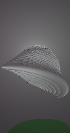

# Java 3D Raytracer Engine

A custom, multi-threaded CPU 3D Raytracer built from scratch in Java. This engine simulates physical light transport to render photo-realistic 3D scenes, supporting complex OBJ meshes, recursive reflections, refraction, and realistic camera effects.

## 🚀 Features

* **Multi-Threaded Rendering:** Utilizes Java's `ExecutorService` to distribute ray tracing calculations across all available CPU cores, significantly speeding up render times.
* **Advanced Lighting & Shadows:** * Blinn-Phong specular reflection model.
  * `AreaLight` implementation for realistic **soft shadows** using jittered disk sampling.
  * Support for colored `PointLight`s and intersecting light bounds.
* **Physically Based Materials:**
  * **Refraction (Glass/Water):** Calculates light bending using Snell's Law, including Total Internal Reflection (TIR).
  * **Reflection (Mirrors/Metals):** Recursive ray bouncing (up to 2 max bounces) for metallic surfaces.
  * Configurable ambient, diffuse, specular, and shininess coefficients.
* **Camera Effects:**
  * **Depth of Field (DoF):** Simulates physical camera lens apertures and focal distances to generate foreground and background blur.
  * Adjustable Horizontal/Vertical Field of View (FOV) and clipping planes.
* **3D Geometry & Meshes:**
  * Native Wavefront `.obj` file parser (`OBJReader`).
  * Vertex normal smoothing for smooth surface shading.

## 🖼️ Example Renders

*Example of multi-point light interactions and metallic reflections on an abstract model.*

*Example of Depth of Field (DoF) blurring the background while keeping the foreground object in focus.*

## ⚙️ Project Architecture

* **`Raytracer.java`**: The core execution loop. Handles multi-threading, the recursive `traceRay` method, shadow occlusion checks, and pixel color accumulation.
* **`Scene.java`**: Orchestrates the world state, holding the `Camera`, `Object3D` entities, and `Light` sources.
* **`Camera.java`**: Calculates ray origins and directions mapped to a 2D image plane based on resolution and FOV.
* **`AreaLight.java`**: Distributes random samples across a rectangular plane to compute average light intensity, creating soft shadows.
* **`OBJReader.java`**: Reads `.obj` files, parses vertices and faces, applies affine transformations (scale/rotation), and groups faces into `Triangle` arrays.

## 👨‍💻 Authors
**Jorge Fong @fongajorge**
**Jafet Rodriguez**
