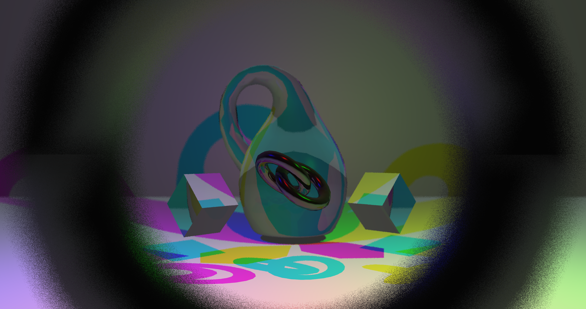
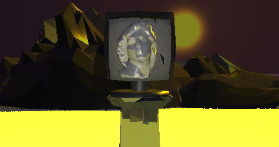
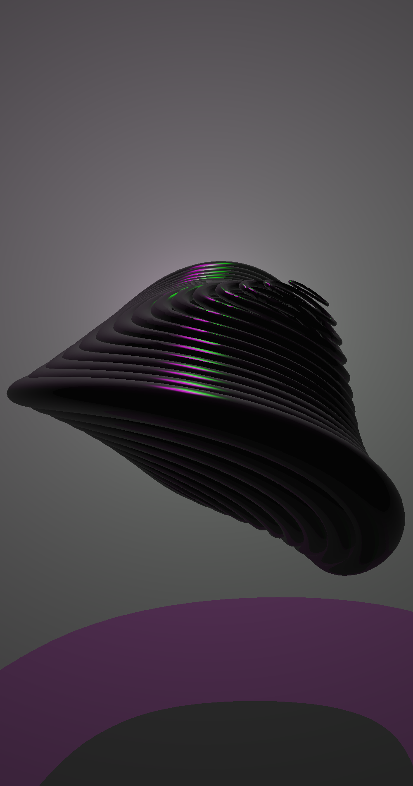

# Java 3D Raytracer Engine

A custom, multi-threaded CPU 3D Raytracer built from scratch in Java. This engine simulates physical light transport to render photo-realistic 3D scenes, supporting complex OBJ meshes, recursive reflections, refraction, and realistic camera effects.

## 🚀 Features

* **Multi-Threaded Rendering:** Utilizes Java's `ExecutorService` to distribute ray tracing calculations across all available CPU cores, significantly speeding up render times.
* **Advanced Lighting & Shadows:** * Blinn-Phong specular reflection model.
  * `AreaLight` implementation for realistic **soft shadows** using jittered disk sampling.
  * Support for colored `PointLight`s and intersecting light bounds.
* **Physically Based Materials:**
  * **Refraction (Glass/Water):** Calculates light bending using Snell's Law, including Total Internal Reflection (TIR).
  * **Reflection (Mirrors/Metals):** Recursive ray bouncing (up to 2 max bounces) for metallic surfaces.
  * Configurable ambient, diffuse, specular, and shininess coefficients.
* **Camera Effects:**
  * **Depth of Field (DoF):** Simulates physical camera lens apertures and focal distances to generate foreground and background blur.
  * Adjustable Horizontal/Vertical Field of View (FOV) and clipping planes.
* **3D Geometry & Meshes:**
  * Native Wavefront `.obj` file parser (`OBJReader`).
  * Vertex normal smoothing for smooth surface shading.

## 🖼️ Example Renders



* *Example of light refraction through a glass Klein bottle and complex multi-colored light interactions, featuring heavy Depth of Field (DoF) blurring around the camera lens edges.*



* *Example of complex .obj mesh rendering, showcasing a metallic bust on a pedestal framed against low-poly mountains and a prominent background light source.*



* *Example of multiple colored point lights (magenta and green) generating distinct specular highlights on a highly reflective, ribbed abstract model.*

## 🌳 Project Structure

```text
├── src/edu/up/isgc/cg/raytracer/
│   ├── Raytracer.java          # Main engine controller and pixel rendering loop
│   ├── Scene.java              # Holds objects, cameras, and light sources
│   ├── Ray.java                # Represents a geometric ray (Origin + Direction)
│   ├── Intersection.java       # Stores intersection data (distance, normal, object)
│   ├── Vector3D.java           # Linear algebra utilities for 3D space
│   │
│   ├── lights/                 # Lighting sub-system
│   │   ├── Light.java          # Base abstract light class
│   │   ├── PointLight.java, DirectionalLight.java, SpotLight.java
│   │   └── AreaLight.java      # Used for soft shadow calculations
│   │
│   ├── materials/              # Surface appearance configurations
│   │   └── Material.java       # Defines diffuse, specular, and reflective properties
│   │
│   ├── objects/                # Scene graph nodes and geometry
│   │   ├── IIntersectable.java # Interface for ray-object intersection math
│   │   ├── Camera.java         # Viewport configuration (FOV, Resolution, DoF)
│   │   ├── Object3D.java       # Base class for all renderable entities
│   │   ├── Sphere.java, Plane.java, Triangle.java
│   │   └── Model3D.java        # Holds parsed .obj meshes assembled from Triangles
│   │
│   └── tools/                  # Helper utilities
│       ├── Barycentric.java    # Calculates weight coordinates for triangle interpolation
│       └── OBJReader.java      # Parses external 3D model files
│
├── renders/                    # Additional directory for output images
├── obj/                        # Sample 3D meshes (Helios, Klein, Mountains, PC, etc.)
└── README.md                   # Project documentation

```

## 👨‍💻 Authors

* **Jorge Fong**
* **Jafet Rodriguez**
